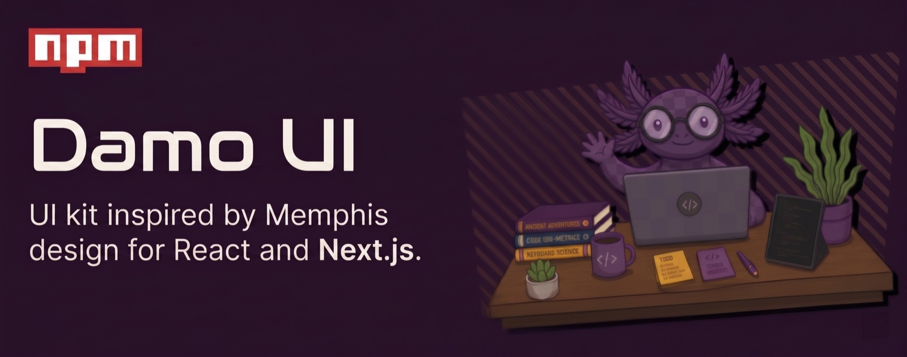

<p align="center">
  
</p>

<h1 align="center">damo-ui</h1>

<p align="center">
  Memphis-inspired React components for Next.js — copy-paste into your project with the damo-ui CLI (shadcn-style).
</p>

<p align="center">
  <a href="https://www.npmjs.com/package/damo-ui"></a>
  <a href="./LICENSE"></a>
  
  
</p>

<p align="center">
  <b><a href="https://damo-ui.com">📖 Docs &amp; live playground</a></b> · <a href="https://damo-ui.com/r">registry</a>
</p>

> **1.0 — copy-paste, shadcn-style.** Components are distributed via the
> `damo-ui` CLI: it copies the source into your project so you own and can tweak
> every line. There is no runtime component-library package to install — the
> components are copy-paste (the `damo-ui` CLI and `@axologic/mcp` server are
> the only npm packages). The old `damo-ui@0.x` _library_ package is deprecated;
> migrate with `npx damo-ui codemod migrate-from-npm`.

## Why damo-ui?

- **Memphis-design primitives, palette-agnostic** — geometric shape decorations, chunky offset shadows, and four ready-to-opt-in palettes (`default`, `sunset`, `cyberpunk`, `forest`). Ships neutral grayscale by default.
- **Accessible by default** — Dialog, Dropdown, Tooltip, Popover, Select, Tabs, and other interactive components inherit keyboard navigation, focus management, and ARIA semantics from Radix UI primitives.
- **Theme × palette × density, orthogonal** — flip light/dark, swap palette, and pick density (`compact`, `normal`, `comfortable`) live, all driven from `<html>` data attributes.
- **Tailwind v4-first** — CSS-first configuration; the design tokens / theme are copied into your project (`damo-ui add base`).
- **54 components, copy-paste** — Foundations, Forms, Feedback, Navigation, Data, Cards, and Layout. Added with `damo-ui add <name>`; you import them from your own `@/components/ui/*`.

## Quick start (Next.js + Tailwind v4)

```bash
npx damo-ui init                 # writes components.json
npx damo-ui add base             # copies the design tokens / theme / global CSS into ./styles
npx damo-ui add button dialog    # copies the components (+ cn, icons, deps) into your project
npx damo-ui list                 # browse everything in the registry
```

Wire the copied CSS into your global stylesheet:

```css
/* app/globals.css */
@import './styles/tokens.css';
@import './styles/globals.css';

@import 'tailwindcss';
@import './styles/theme.css';

/* Let Tailwind v4 scan your copied components for class names: */
@source './components/ui/**/*.{ts,tsx}';
```

Then use a component — imported from your own project, not a package:

```tsx
import { Button } from '@/components/ui/button'
import { Card } from '@/components/ui/card'

export default function Page() {
  return (
    <Card variant="featured">
      <Button variant="primary">Click me</Button>
    </Card>
  )
}
```

Supported peer versions: React **≥ 18**, Tailwind **≥ 4** (`npx damo-ui add`
installs each component's npm deps, e.g. Radix, automatically).

### Optional: theme, palette & density

Drive them from `<html>` data attributes:

```html
<html data-theme="light" data-palette="default" data-density="normal"></html>
```

| Attribute      | Values                                           |
| -------------- | ------------------------------------------------ |
| `data-theme`   | `light` \| `dark`                                |
| `data-palette` | `default` \| `sunset` \| `cyberpunk` \| `forest` |
| `data-density` | `compact` \| `normal` \| `comfortable`           |

All combinations are orthogonal and switch live without remount.

## Component inventory (54)

- **Foundations:** Icon (+31 atomic), Box, Container, AspectRatio, ScrollArea, Separator, Ornament, MemphisShape (8 shape variants), FormField
- **Core actions & surfaces:** Button, IconButton, Card (5 variants: `default | elevated | featured | interactive | inverse`), Dialog (`severity` + `tone`), Drawer, Banner
- **Forms:** Input, Textarea, Label, Checkbox, RadioGroup, Switch, Slider, SegmentedControl, Select, DatePicker, Combobox, Popover, ColorPicker, AttrToggleGroup
- **Feedback:** Tooltip, Toast, Progress, Spinner, Skeleton, Badge (7 variants), Chip, Hint
- **Navigation:** Tabs, DropdownMenu, ContextMenu, NavItem (default + onDark tones), Breadcrumbs, Pagination
- **Data:** Avatar, AvatarGroup, Accordion, Table, Stat, Medal (5 ranks)
- **Cards:** UserCard, FeatureCard, ArticleCard
- **Layout:** AppShell, AppTopBar, PageHeader, Sidebar — compose to scaffold a full app shell:

```tsx
// after `npx damo-ui add app-shell app-top-bar sidebar page-header`
import { AppShell } from '@/components/ui/app-shell'
import { AppTopBar } from '@/components/ui/app-top-bar'
import { Sidebar } from '@/components/ui/sidebar'
import { PageHeader } from '@/components/ui/page-header'

export default function DashboardLayout({ children }) {
  return (
    <AppShell topBar={<AppTopBar>…</AppTopBar>} sidebar={<Sidebar>…</Sidebar>}>
      <PageHeader title="Dashboard" />
      {children}
    </AppShell>
  )
}
```

The full live reference is the docs site at `apps/web` — see "Local dev" below to run it.

## The packages

| Package         | What it is                                           | Published?                   |
| --------------- | ---------------------------------------------------- | ---------------------------- |
| `damo-ui`       | The CLI — copy-paste components from the registry    | ✅ npm — `npx damo-ui`       |
| `@axologic/ui`  | The component source (this repo); shipped copy-paste | ❌ private workspace package |
| `@axologic/mcp` | MCP server — lets AI agents add components for you   | ✅ npm — `npx @axologic/mcp` |

The CLI + MCP server are published; components themselves are **not** an npm
package — they live in the **registry** served from the
docs site at `https://damo-ui.com/r` and are copied into your project by the
CLI — there is no runtime library package to install. (`@axologic/*` is the
workspace scope; the `@damo-ui` npm scope was unavailable.)

## Tech stack

- React 19 (peer ≥ 18)
- Tailwind v4 (CSS-first)
- Radix UI primitives
- TypeScript strict, pnpm workspace, tsup build
- Vitest unit + Playwright e2e

## Repo structure

- `packages/ui` — the library (`@axologic/ui`); `packages/cli` — the CLI (`damo-ui`); `packages/mcp` — the MCP server (`@axologic/mcp`)
- `apps/web` — Next 15 docs + showcase site (private; not published)
- `e2e` — Playwright end-to-end tests (private)

## Local dev

```bash
pnpm install
pnpm dev           # runs Ladle (port 61000) + Next web app (port 3000) in parallel
```

- Web app → http://localhost:3000
- Ladle → http://localhost:61000

### Scripts

- `pnpm build` — build the library (tsup + CSS + Tailwind preset)
- `pnpm test` — Vitest unit tests
- `pnpm test:e2e` — Playwright against the running web app
- `pnpm lint` — ESLint across all workspaces + docs-sync guardrail
- `pnpm format` — Prettier autofix
- `pnpm format:check` — Prettier check

## Theming

The design system uses a three-layer architecture:

1. **Raw palette** (`--plum-*`, `--gold-*`, `--paper-*`) — private scale defined in `tokens.css`. Not exposed as Tailwind utilities; used only to compute semantic values.
2. **Semantic tokens** — public, paired bg+fg utilities (`bg-background` / `text-foreground`, `bg-primary` / `text-primary-foreground`, etc.). These are the correct layer to use in product code.
3. **Identity tokens** — component-specific overrides (`--nav-on-dark-*`, `--badge-*`, `--chart-*`).

For the **current** token surface, see the docs site at `apps/web/app/docs/foundations/tokens` — that's the live, post-audit reference. See [`CHANGELOG.md`](./CHANGELOG.md) for the migration history (0.1 → 0.2 theme refactor and the 1.0.0-candidate audit).

## Contributing

See [`CONTRIBUTING.md`](./CONTRIBUTING.md). Short version: every public component must have a `/docs/components/<name>/page.tsx` page, and the docs site mounts the **real** library — no hand-rolled JSX.

## License

[MIT](./LICENSE) © 2026 Simone Schioppo.
